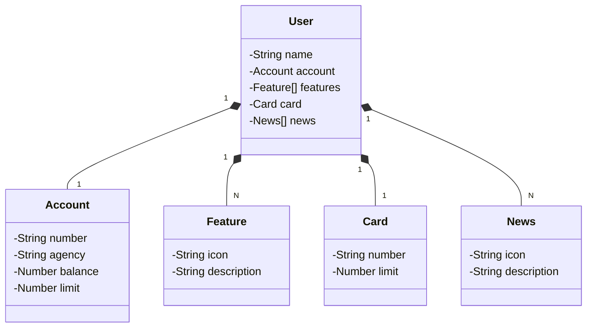

# 🏦 Santander Dev Week 2023

## 🚀 Java RESTful API
API desenvolvida em **Java** com **Spring Boot 3** para simular o core de um sistema de gerenciamento de usuário bancário, focada no desafio da Santander Dev Week.

## ✨ Tecnologias Principais

| Categoria | Tecnologia | Objetivo |
| :--- | :--- | :--- |
| **Linguagem** | Java 17 | Versão LTS mais robusta. |
| **Framework** | Spring Boot 3 | Autoconfiguração e alta produtividade. |
| **Build Tool** | **Gradle** | Gerenciamento de dependências e construção do projeto. |
| **Persistência** | Spring Data JPA | Simplificação do acesso a dados SQL. |
| **Documentação** | OpenAPI (Swagger) | Documentação de API interativa e de fácil consumo. |
| **Deploy** | Railway | Facilidade no deploy e monitoramento em nuvem. |

## 💡 Abstração e Design

* **Figma:** A modelagem e abstração do domínio desta API foram guiadas pelo projeto no Figma, garantindo uma estrutura lógica e alinhada aos requisitos.
    * **Link do Figma:** [SANTANDER - Projeto Web Mobile](https://www.figma.com/design/0ZsjwjsYlYd3timxqMWlbj/SANTANDER---Projeto-Web-Mobile?node-id=2-92&p=f&t=EUEZUNrz7zSpV1oP-0)

## 🔗 Links e Acesso

* **API Base URL (Railway):** [https://sdw2023brunolosouza.up.railway.app](https://sdw2023brunolosouza.up.railway.app)
* **Documentação (Swagger UI):** [https://sdw2023brunolosouza.up.railway.app/swagger-ui/index.html](https://sdw2023brunolosouza.up.railway.app/swagger-ui/index.html)

## 🧩 Diagrama de Classes

*O diagrama abaixo ilustra a estrutura de dados central da API e as relações entre as entidades:*

Execução Local
Para rodar o projeto, utilize Java 17+ e o Gradle Wrapper (incluso no projeto).

1° Clone o repositório:
git clone https://github.com/BrunoLOSouza/Santander_Dev_Week_2023.git
2° Execute a aplicação:
./gradlew bootRun
Se estiver no Windows, use gradlew bootRun.

✒️ Autor
Bruno L. Souza - https://www.linkedin.com/in/bruno-lopes-de-oliveira-souza-784764372/
